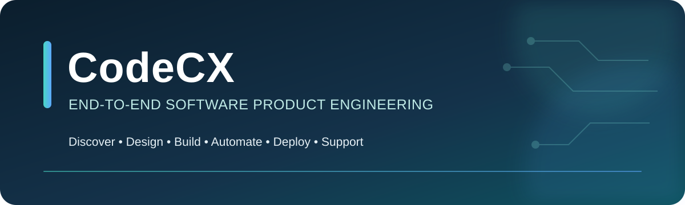
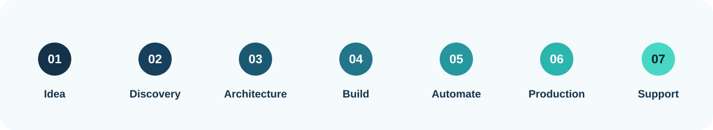
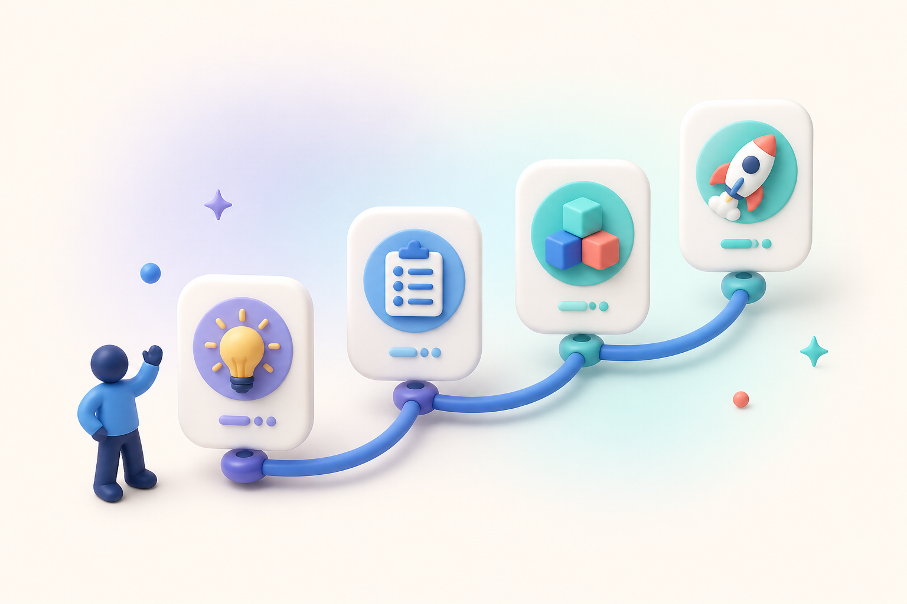

  

 

CodeCX helps companies turn ideas, operational needs, and complex workflows into secure, scalable software products. We cover the complete product lifecycle—from discovery and requirements to architecture, delivery, automation, production, and ongoing support.

## What we deliver

| Capability | Business outcome |
|---|---|
| **Product Discovery & Requirements** | Clear BRDs, PRDs, scope, priorities, roadmaps, and acceptance criteria |
| **System Design & Architecture** | Maintainable architecture, data models, APIs, integrations, roles, and security boundaries |
| **UI/UX & Full-Stack Engineering** | Responsive web products, portals, dashboards, backends, APIs, and PWAs |
| **AI & Workflow Automation** | Governed AI workflows, agents, prompt engineering, n8n automation, and human approval gates |
| **Data & Analytics** | Reliable data models, transformation, reporting, dashboards, KPIs, and operational insight |
| **DevOps & Production Support** | Containerized deployment, CI/CD, monitoring, troubleshooting, releases, maintenance, and support |

## From idea to production

  

  

## Technology ecosystem

## How we engage

- **Discovery & Blueprint** — turn a business need into an implementation-ready product and technical plan.
- **End-to-End Delivery** — design, build, test, deploy, and hand over a complete software product.
- **Modernization & Integration** — upgrade existing systems, connect platforms, and automate workflows safely.
- **Production Partnership** — monitor, improve, maintain, and support live systems after launch.

## Engineering standards

- Clear scope, measurable outcomes, and milestone-based delivery
- Secure configuration, least-privilege access, and privacy-aware design
- Automated testing, traceable releases, monitoring, and recovery planning
- Human approval for sensitive, commercial, or irreversible automation
- Practical documentation and maintainable handover

## Private by design

Client identities, business domains, source code, production data, screenshots, and implementation details remain private. This public profile presents CodeCX capabilities and engineering standards without exposing confidential work.

  

